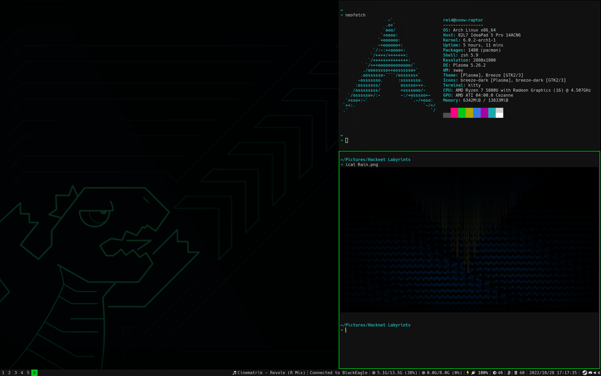

# Reiddragon's Sway
My wonky Sway config, heavily biased towards my own weird setup so you may have to make heavy edits before it's usable on your system

## Extra components I use (not included with Sway):
- [bemenu](https://github.com/Cloudef/bemenu) - launcher, like dmenu, but configurable without recompiling
- [Gammastep](https://gitlab.com/chinstrap/gammastep) - night light
- [grim](https://github.com/emersion/grim) and [slurp](https://github.com/emersion/slurp) - screenshots
- [Hack Nerd Fonts](https://github.com/ryanoasis/nerd-fonts) - font used trough my system
- [i3blocks](https://github.com/vivien/i3blocks) - status generator for bars using the i3bar protocol
    - also using it with some blocklets from [i3blocks-contrib](https://github.com/vivien/i3blocks-contrib) and [some of my own](blocklets/)
- KDE Connect - phone integration yanked from Plasma
- Kitty - Terminal Emulator
- kwallet - Secrets Wallet
- [light](https://github.com/haikarainen/light) - brightness control
- [Mako](https://mako-project.org) - Notification daemon for (some) Wayland compositors
- [mpd-mpris](https://github.com/natsukagami/mpd-mpris) - MPD client that reveals an MPRIS2 interface
- Plasma Browser Integration - some browser integration yanked from Plasma
- pactl - volume control, should be shipped with PulseAudio and PipeWire
- [playerctl](https://github.com/altdesktop/playerctl) - MPRIS media controls
- [swaylock-effects](https://github.com/mortie/swaylock-effects) - fork of swaylock with extra bling
- [wob](https://github.com/francma/wob) - volume and brightness popup

## Some oddities about my setup
- the config is split in multiple files that roughly group related settings
- bemenu, Mako, swaylock-effects, swayidle, and wob are all configured with flags within the Sway config files
    - this leads to mako, wob, and instances of swaylock(-effects) started by swayidle to only update their settings after restarting the session, may look into fixing this later
- the colour schemes have a somewhat weird format, generally the [colour scheme files](colours/) define a palette then map a bunch of variables from different progs that use the colourschemes to the right colours from the palette, check the defined schemes for details
- somewhat heavy reliance on Plasma components, so maybe not the best sway config to use if you want something lightweight (altho even with all the Plasma components, Sway is far lighter than many full fledged DEs)

## Scripts
The repo also contains a few scripts I wrote for this setup, namely:
- [path_gen](scripts/path_gen) - Python script to generate the path for bemenu and other dmenu-like launchers
    - not a very great script, stops working the moment you have a non-existant directory in your $PATH
- [scheme_gen](scripts/scheme_gen) - included Python script to generate Sway theme palettes from [terminal.sexy](https://terminal.sexy/) JSONs

